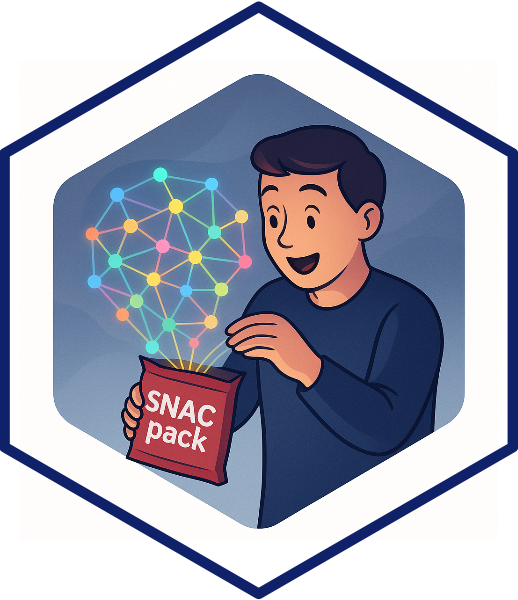

# SNACpack

## *Social Network Analysis for Crime (Analysts) Package*

{width=25%}

<br>

`SNACpack` is a package developed for crime analysts and criminologists conducting social network analysis (SNA).  
It includes datasets and helper functions used in the [*Social Network Analysis*]() course in the [Master of Science in Crime Analysis](https://ccj.asu.edu/degree-programs/ms-crime-analysis) 
program and the [*Statistical Analysis of Network Data (SAND)*](https://jacobtnyoung.github.io/SAND/) 
course for the [Criminology and Criminal Justice, PhD](https://ccj.asu.edu/content/criminology-and-criminal-justice-phd). Both
courses are taught in the [School of Criminology and Criminal Justice](https://ccj.asu.edu) at [Arizona State University](https://www.asu.edu).

<br>

`SNACpack` is a companion package to the books [*Social Network Analysis for Crime Analysts*](https://jacobtnyoung.github.io/snaca-textbook/) and  [*Social Network Analysis for Crime Analysts using R*](https://jacobtnyoung.github.io/snaca-r/). The former is an introductory textbook for crime analysts learning SNA and the latter is a set of *tutorials* that show the "how to" of SNA in RStudio.

---

## Installation  

To install SNACpack from GitHub:

```r
# install devtools (if not already installed)
install.packages( "devtools" )  

# install the package from the Github repository
devtools::install_github( "jacobtnyoung/SNACpack" )
```

---

## Example Usage  

```r

# load the library for SNACpack
library( SNACpack )

```

`SNACpack` includes multiple networks for the user. The data are objects of class `network`, so you need to install the `network` package.  

<br>

```r

install.packages( "network" )
library( network )

```

<br>

Now, you can look at the data objects. For example, `SNACpack` includes data from Mangia Natarajan’s study of a large cocaine trafficking organization in New York City. The network is directed, binary ties of communication between individuals collected from police wiretaps of telephone conversations. This network is named `cocaine_dealing_net`.

```r

# examine the help page for the network
?cocaine_dealing_net

# print it out to see the features
cocaine_dealing_net

```

<br>

---

### Issue Reporting

If you encounter a problem with the package or have suggestions for improvement, please submit an issue to the [Github Issues page](https://github.com/jacobtnyoung/SNACpack/issues) for this package. Thanks in advance!

<br>
<br>
